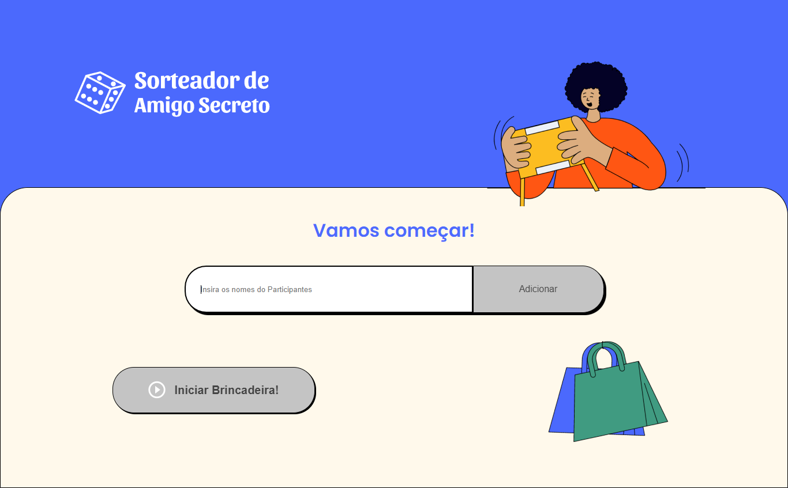
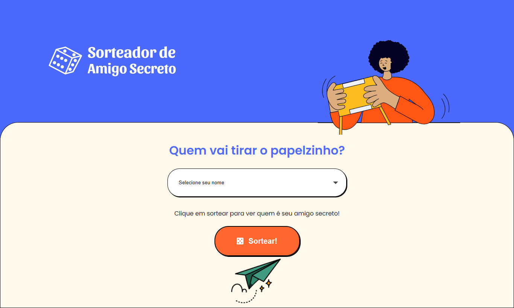
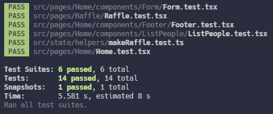

# Sorteador de Amigo Secreto

Projeto feito para estudar Jest. Sorteador de Amigo Secreto desenvolvido durante o curso de React: testando os seus componentes da [Alura](https://cursos.alura.com.br/course/react-testando-componentes).
 
[Link deploy](https://sorteador-amigo-secreto.netlify.app)
  

### Tecnologias:

- [Create React App](https://create-react-app.dev)
- [React](https://reactjs.org)
- [Typescript](https://www.typescriptlang.org)
- [Jest](https://jestjs.io/)
- [Styled Components](https://styled-components.com)

 

## Home

 

## Sorteio

 

## Testes

